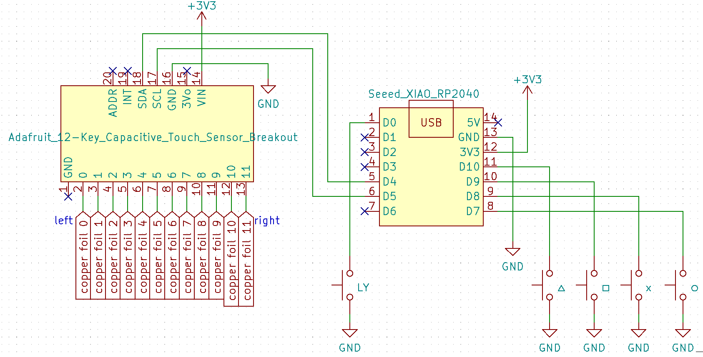

# PjdController
Seeed XIAO RP2040 で 初音ミク Project DIVA MEGA39’s＋ 用アーケードコントローラー を作るためのコード。スライドの同時押しには未対応。
RP2040 を搭載したボードで、Arduino-Picoでサポートされているものは、ちょっとコードを変更すれば動くはず。

# 遅延
自作の遅延測定アプリで遅延を測定したところ、平均で3.5ミリ秒くらいでした。

同じ測定方法で、GP2040の測定を行ったところ平均1ミリ秒を切っていたので、測定方法に問題はないと思われます。

# 使用パーツ
* Seeed XIAO RP2040
* Adafruit 12-Key Capacitive Touch Sensor Breakout - MPR121
* 銅箔テープ
* ゲームスイッチ 4個
* タクトスイッチ 1個
* その他、ブレッドボードや配線材

partscabi.netにまとめています。 [partscabi.net](https://partscabi.net/list/a633d7ea-ac57-4b9a-8670-2d2e5a3435d6)

# 環境構築
Visual Studio Code(VS Code) のArduino 拡張機能を使用しています。ボードの設定が保存されているので、VS Codeで開くと、ボード設定が復元されます。Arduino IDEも使えます。Arduino IDEは、ボード設定が保存されない(前回の設定を覚えているだけ)ので、ビルドするときに「ツール」→「ボード」の設定を確認してください。
* Arduino IDE をインストールする。
* [Arduino-Pico](https://github.com/earlephilhower/arduino-pico) ボードパッケージを導入する。詳細は[こちら](https://github.com/earlephilhower/arduino-pico#installing-via-arduino-boards-manager)を参照。
* Visual Studio Code をインストールする。(オプション)
* Visual Studio Code の Arduino 拡張機能をインストールする。(オプション)
* pjdController.ino ダブルクリックでArduino IDEを開く。(Arduino IDEを使う場合)  
pjdController.ino の有るフォルダで右クリック→「Codeで開く」を押してVS Codeで開く。(VS Code を使う場合)
* Arduino IDEを使う場合、ボードの設定をする。  
「ツール」→「ボード」→「Raspberry Pi RP2040 Boards」→「Seeed XAIO RP2040」を選択する。  
もう一度ツールメニューを開くとメニューが増えている。  
「USB Stack」→「Adafruit TinyUSB」を選択する。
* Seeed XIAO RP2040 を Boot ボタンを押しながらPCに接続する。
* IDEの書き込みボタンを押す。シリアルポートの設定は何でも良いです。  
二回目以降は、シリアルポートとして認識もされるので、ブートボタンを押しながら接続する必要はありません。ツールメニューから適切な項目を選択して書き込みを行うと自動でリセットされます。

# 配線
各スイッチは、デジタルピンとグランドの間に配置します。D7からD10とD0に各スイッチの片方を接続し、反対側をグランドに接続します。Steamの機能でボタンの配置を設定するので、どこにどのボタンを接続しても構いません。

12-Key Capacitive Touch Sensor Breakout と Seeed XIAO RP2040 の SDA と SCL をそれぞれ接続します。Touch Sensor Breakout の VIN と XIAO RP2040 の 3V3 を、Touch Sensor Breakout の GND と XIAO RP2040 の GND を接続します。

タッチセンサである銅箔テープは、左が Touch Sensor Breakout の 0、右が 11 になるように接続します。

